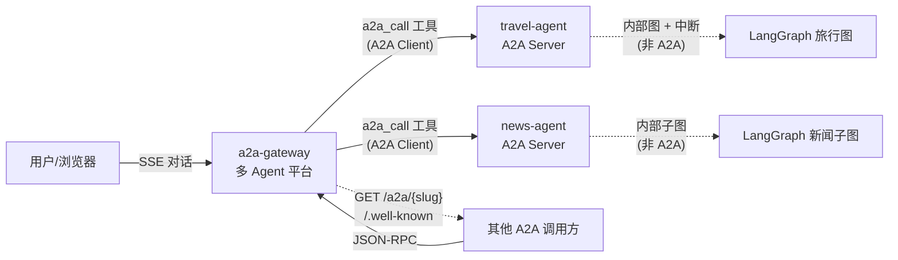
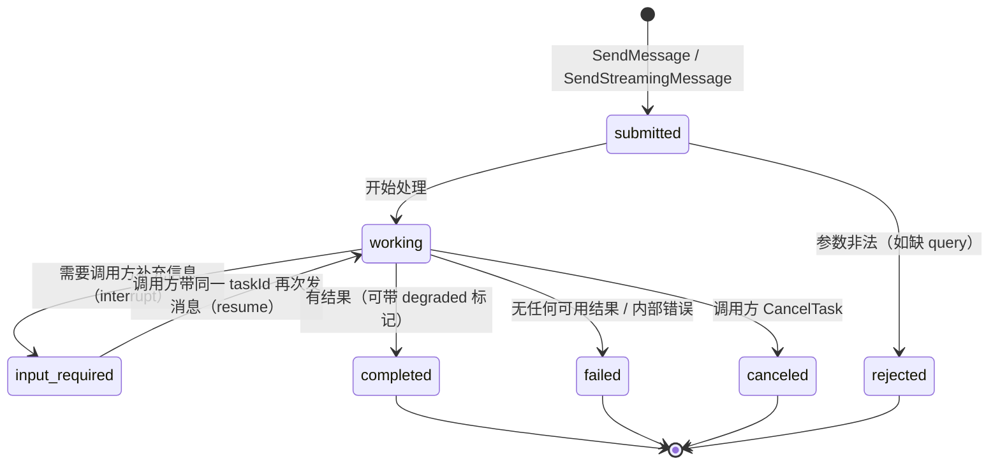
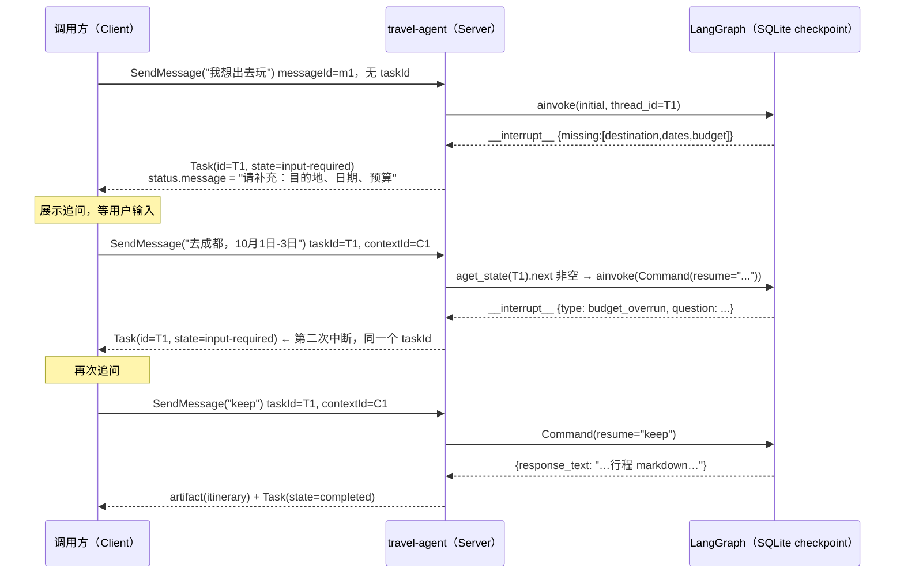
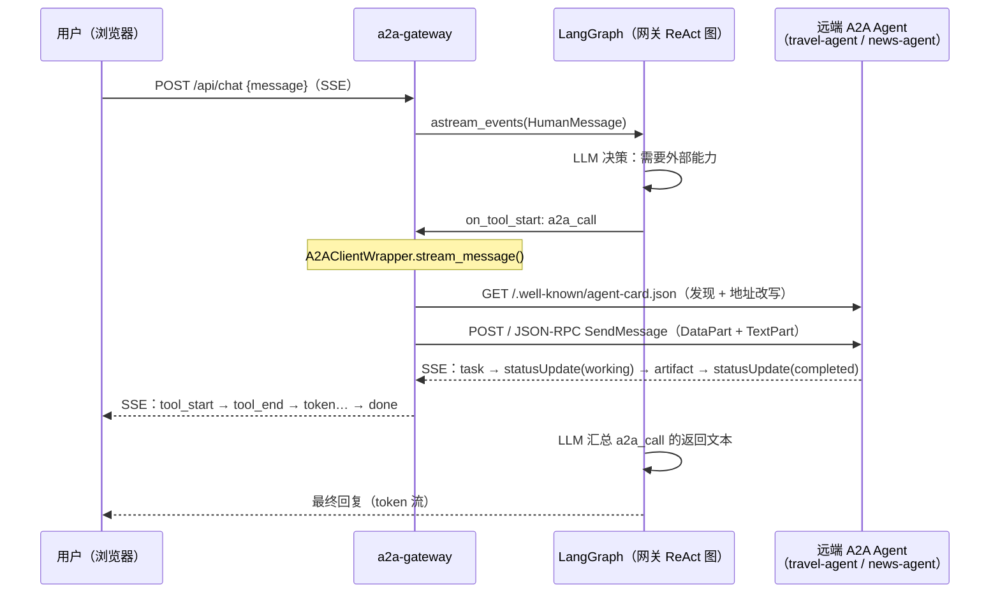

# A2A 协议实践报告

> 基于三个自研实验项目：`travel-agent`、`a2a-gateway`、`news-agent`
>
> 覆盖主题：协议原理 · 服务端封装 · 客户端调用 · 中断（input-required）处理 · 工程踩坑

---

## 目录

- [1. 三个项目在做什么](#1-三个项目在做什么)
- [2. A2A 原理：Agent 之间的发现与任务委派](#2-a2a-原理agent-之间的发现与任务委派)
- [3. 如何封装 A2A Server](#3-如何封装-a2a-server)
- [4. 如何调用一个 A2A Agent](#4-如何调用一个-a2a-agent)
- [5. 如何处理中断（input-required）](#5-如何处理中断input-required)
- [6. 三个项目的横向对照与端到端链路](#6-三个项目的横向对照与端到端链路)
- [7. 工程实践清单（踩坑合集）](#7-工程实践清单踩坑合集)
- [8. 结论与下一步](#8-结论与下一步)
- [附录 A：关键文件索引](#附录-a关键文件索引)
- [附录 B：术语表](#附录-b术语表)

---

## 1. 三个项目在做什么

### 1.1 项目一览

| 项目 | 定位 | 在 A2A 中的角色 | 技术栈 | 对外端口 |
| --- | --- | --- | --- | --- |
| `travel-agent`（旅游规划） | 对话式旅行规划：信息不全时中断追问，调高德 MCP 取真实数据，产出逐日行程 | **A2A Server**（JSON-RPC，手写 route 组合 SDK） | FastAPI + LangGraph + SQLite checkpointer + 高德 MCP | 本地 8000 / 容器 10101 |
| `news-agent`（新闻分析） | 多源抓取 → 去重 → 相关性过滤 → 结构化分析 → 话题摘要 | **A2A Server + 示例 Client**（协议面全部由 SDK 提供） | FastAPI + LangGraph + a2a-sdk + SQLite 缓存 | 9901 |
| `a2a-gateway`（多 Agent 平台） | 可视化配置 Agent、绑定 A2A 目标为 LLM 工具、SSE 对话、管理中心 | **A2A Client 为主 + 可选 A2A Server**（把平台内 Agent 对外发布） | FastAPI + LangGraph + PostgreSQL + React/Next.js | 经 nginx 统一入口 |

### 1.2 三者的协作关系



核心事实：**三个项目之间没有任何私有接口**，全部走标准 A2A 契约（Agent Card + JSON-RPC + SSE），因此互为"黑盒"，可独立部署、独立升级。

### 1.3 为什么这套组合适合学 A2A

| 学习维度 | 由哪个项目覆盖 |
| --- | --- |
| Agent Card 三种构建方式（手写 route / SDK 路由 / 动态生成） | 三个项目各一种，正好对照 |
| Executor 与业务图（LangGraph）的桥接 | `travel-agent`（含中断）、`news-agent`（含进度/取消） |
| 客户端发现、建连、流式消费、错误分类、重试 | `a2a-gateway`（生产级）、`news-agent`（教学级 `NewsA2AClient`） |
| 多轮中断（input-required ↔ resume） | `travel-agent`（核心验证目标） |
| 0.3 / 1.0 双版本兼容 | 三处均有 `enable_v0_3_compat` 与兼容路径 |
| 鉴权（Bearer / API Key）与发现路径豁免 | `travel-agent`、`news-agent` |
| 跨容器/反代的地址问题 | `a2a-gateway` 的 `_merge_interface_url`、`_public_base_url` |

---

## 2. A2A 原理：Agent 之间的发现与任务委派

### 2.1 从 MCP 到 A2A：能力边界的区别

| | MCP | A2A |
| --- | --- | --- |
| 解决的问题 | Agent **使用工具/数据源**（横向接资源） | Agent **调用另一个 Agent**（横向接能力） |
| 交互形态 | 一个进程内的工具调用（函数、资源、提示） | 跨网络的服务调用（任务委派） |
| 对方是否"不透明" | 工具是确定的输入输出 | Agent 是黑盒：它可能反问、可能长跑、可能降级 |
| 典型实现 | `mcp_client.py`（高德 MCP、MCP 服务管理） | 本报告全部内容 |

`travel-agent` 同时使用两者：对外是 A2A Server，对内通过 MCP 调高德地图——**A2A 管"Agent 间"，MCP 管"Agent 与工具间"**，这是当前主流架构的分工方式。

### 2.2 协议栈全景

A2A 可拆成四层理解（每一层都能在三个项目里找到对应实现）：

```
┌──────────────────────────────────────────────────────────┐
│ 发现层    Agent Card（/.well-known/agent-card.json）      │
│           自我介绍：我是谁、能做什么、怎么联系我、要不要鉴权 │
├──────────────────────────────────────────────────────────┤
│ 数据模型层 Message / Part / Task / Artifact / AgentSkill   │
│           （a2a-sdk 1.x 底层是 protobuf 定义）             │
├──────────────────────────────────────────────────────────┤
│ 传输层    JSON-RPC 2.0（POST /）、HTTP+JSON REST、SSE 流式 │
│           版本协商：A2A-Version 头（1.0）或缺省 0.3 语义   │
├──────────────────────────────────────────────────────────┤
│ 生命周期层 submitted → working → input-required/completed  │
│           /failed/canceled/rejected，配套查询/订阅/取消接口 │
└──────────────────────────────────────────────────────────┘
```

### 2.3 核心数据模型

#### （1）AgentCard —— 能力契约与联系方式

`news-agent` 的卡片（`src/news_agent/a2a/card.py`）最完整，包含 1.0 的全部关键字段：

```jsonc
{
  "name": "news-agent",
  "description": "...",
  "version": "0.1.0",
  "supportedInterfaces": [                       // 1.0：多绑定列表（0.3 只有单个 url 字段）
    { "url": "http://localhost:9901", "protocolBinding": "JSONRPC",   "protocolVersion": "1.0" },
    { "url": "http://localhost:9901", "protocolBinding": "HTTP+JSON", "protocolVersion": "1.0" }
  ],
  "capabilities": {
    "streaming": true,
    "pushNotifications": false,
    "extensions": [                              // 1.0 的 AgentSkill 没有 schema 字段 → 挂扩展
      { "uri": "https://news-agent.dev/a2a/skill-schemas", "params": { "requestSchema": {...}, "resultSchema": {...} } },
      { "uri": "https://news-agent.dev/a2a/task-progress", "description": "statusUpdate.metadata = {stage, kind, data}" }
    ]
  },
  "defaultInputModes": ["application/json", "text/plain"],
  "defaultOutputModes": ["application/json", "text/plain"],
  "securitySchemes": { /* 启用鉴权时自动声明 bearer + api_key */ },
  "skills": [
    { "id": "fetch_news",     "name": "Fetch news",     "tags": ["..."], "examples": ["..."] },
    { "id": "summarize_news", "name": "Summarize news", "tags": ["..."], "examples": ["..."] },
    { "id": "analyze_trend",  "name": "Analyze trend",  "tags": ["..."], "examples": ["..."] }
  ]
}
```

关键理解：

- **卡片是唯一的"发现入口"**，客户端不需要任何带外配置就能知道：调用地址（`supportedInterfaces[].url`）、是否支持流式（`capabilities.streaming`）、有哪些技能（`skills`）、要不要带凭据（`securitySchemes`）。
- **`skills` 是"能力清单"而非"接口定义"**。1.0 的 `AgentSkill` 只有 `id/name/description/tags/examples`，没有 JSON Schema 字段——所以 `news-agent` 把请求/响应 Schema 放进 `capabilities.extensions`，不理解的客户端会安全忽略；同时另开 `GET /skills` 便于人工调试。
- **`url` 的语义是"调用方可访问的地址"**。`travel-agent` 在返回卡片时用请求的 Host/Scheme 动态补全（`app/main.py`），`a2a-gateway` 用 `X-Forwarded-*` 头推导（`routes/a2a_server.py`）——都是为了在容器/反代环境下卡片地址与真实可达地址一致。
- 本报告中 `news-agent` 的 JSON 片段保留了 `//` 注释说明，**真实返回的卡片是标准 JSON，不含注释**。

#### （2）Message 与 Part —— 输入/输出都是"多部件消息"

一条 `Message` 由 `parts[]` 组成，Part 有三种形态：

| Part 类型 | 用途 | 三个项目中的用法 |
| --- | --- | --- |
| `text`（TextPart） | 人类可读文本 | 双向都用：追问文本、行程 markdown、新闻摘要 |
| `data`（DataPart） | 结构化 JSON（底层 `google.protobuf.Value`） | `{"skill": "summarize_news", "query": "...", "limit": 10}` |
| `file`（FilePart） | 文件引用/内联字节 | 本报告项目未使用 |

`news-agent` 定义的"三种等价输入写法"（见其 README §5.2 与 `executor.py::_extract_payload`）演示了 A2A 的宽容解析实践：

```python
# d:\web\new-agent\src\news_agent\a2a\executor.py
payload: dict[str, Any] = dict(data or {})        # 1. DataPart: {"query": "...", "skill": "..."}
if not payload and text.strip().startswith("{"):  # 2. 纯文本里塞 JSON
    ...
if not payload.get("query"):
    for key in ("query", "topic", "keywords", "q", "input"):
        if metadata.get(key):                     # 3. 请求 metadata
            payload["query"] = metadata[key]
            break
if text and not payload.get("query"):             # 4. 纯文本 "summarize_news: 固态电池" 或 "固态电池"
    ...
```

**工程结论：作为 Server，入参解析要宽容（多形态兼容）；作为 Client，发送时要"双写"（DataPart 给机器 + TextPart 给人看）**。`a2a-gateway` 与 `news-agent` 的客户端都采用双写：

```python
# d:\web\a2a-gateway\src\a2a_gateway\a2a_client.py
message = a2a_pb2.Message(
    message_id=uuid.uuid4().hex,
    role=a2a_pb2.ROLE_USER,
    parts=[
        new_data_part({"query": text}, media_type="application/json"),  # 机器可解析
        new_text_part(text, media_type="text/plain"),                   # 人可读 / 兼容只支持文本的 Server
    ],
)
```

#### （3）Task —— 一次任务委派的完整记录

`Task` 是 A2A 的"会话单元"，关键字段：

```text
Task
├── id          任务 id（服务端生成，或沿用调用方传入的）
├── contextId   上下文 id（同一上下文的任务可被 ListTasks 按 context 过滤）
├── status      { state, message?, timestamp? }   ← 状态机 + 人类可读说明
├── history[]   消息历史（GetTask 的 historyLength 控制返回条数）
└── artifacts[] 结果产物（可多次追加，每次是一个 Artifact）
```

`contextId` 与 `taskId` 的语义区别在 `a2a-gateway` 的 Server 端实现里看得最清楚：

```python
# d:\web\a2a-gateway\src\a2a_gateway\routes\a2a_server.py
context_id = req.message.context_id or req.message.task_id or uuid.uuid4().hex
task_id = req.message.task_id or uuid.uuid4().hex
```

- `taskId`：**一次执行**的标识；`travel-agent` 用它当 LangGraph 的 `thread_id`，即"一个 A2A task = 一条对话线程"。
- `contextId`：**一段上下文**的标识，可跨多个 task 延续；调用方在 Message 上带 `contextId` 时服务端应沿用（`news-agent` README §9 明确此点）。

#### （4）Artifact —— 结果产物（DataPart + TextPart 双形态）

`news-agent` 的产物组装是标准做法——同一份结果发两种形态，兼顾"要结构的调用方"和"只要文本的调用方"：

```python
# d:\web\new-agent\src\news_agent\a2a\executor.py
payload = result.model_dump(mode="json")
parts = [
    new_data_part(payload, media_type="application/json"),   # 完整 NewsResult
    new_text_part(result.summary or "（无摘要）", media_type="text/plain"),
]
await updater.add_artifact(
    parts,
    artifact_id=f"{updater.task_id}-result",
    name="news-result",
    metadata=_metadata({"query": ..., "mode": ..., "counts": ..., "degraded": ...}),
)
```

### 2.4 任务状态机

A2A 定义了 7 个状态（proto 枚举，JSON 里是枚举名 `TASK_STATE_*`，SDK 提供 `state_name()` 转小写展示）：



三个项目对"终态与失败"的语义约定（对客户端理解很重要）：

| 状态 | 触发条件 | 项目实例 |
| --- | --- | --- |
| `rejected` | 请求本身非法，**未开始执行** | `news-agent`：缺 `query` / skill 未知（`executor.py::_build_request` 抛 `SkillRequestError` → `updater.reject(...)`） |
| `failed` | 执行了但拿不到可用结果 | `news-agent`：所有源都无结果；`travel-agent`：内部异常兜底 |
| `completed` + `degraded=true` | **部分成功**：超时返回部分结果、LLM 降级 | `news-agent`：`_timeout_result` 返回已完成阶段结果 |

`rejected` 与 `failed` 分开，是让调用方能区分"我的请求错了（改参数重试）"与"环境/服务问题（稍后重试）"。

### 2.5 传输绑定与版本协商（1.0 vs 0.3）

A2A 1.0 与 0.3 在**线格式上差异不小**，三个项目都做了双版本兼容，差异表如下（全部由项目代码实证）：

| 维度 | A2A 1.0 | A2A 0.3（兼容路径） |
| --- | --- | --- |
| 发现路径 | `/.well-known/agent-card.json` | `/.well-known/agent.json` |
| JSON-RPC 方法名 | `SendMessage` / `SendStreamingMessage` / `GetTask` / `CancelTask` / `SubscribeToTask` | `message/send` / `message/stream` / `tasks/get` / `tasks/cancel` / `tasks/resubscribe` |
| 版本声明 | 请求头 `A2A-Version: 1.0` | 不带头（缺省按 0.3 处理） |
| 卡片结构 | `supportedInterfaces[]`（多绑定列表） | 单个 `url` 字段 |
| Part 线格式 | `{"text": "..."}` / `{"data": {...}}` | `{"kind": "text", "text": "..."}` |
| role 取值 | `ROLE_USER`（proto 枚举名） | `user` |
| 状态取值 | `TASK_STATE_INPUT_REQUIRED` | `input-required`（kebab-case） |
| 响应包装 | `result.task`（Task 嵌在 task 字段下） | `result` 平铺 |

`travel-agent` 的演示脚本把两套写法并列，是最直观的对照教材：

```python
# d:\hub\travel-agent\scripts\a2a_client_demo.py
if protocol == "v1":
    msg = {"messageId": uuid.uuid4().hex, "role": "ROLE_USER", "parts": [{"text": text}]}
    method = "SendMessage"
    headers = {"Authorization": f"Bearer {token}", "A2A-Version": "1.0"}
else:
    msg = {"messageId": uuid.uuid4().hex, "role": "user", "kind": "message",
           "parts": [{"kind": "text", "text": text}]}
    method = "message/send"
    headers = {"Authorization": f"Bearer {token}"}

resp = httpx.post(f"{base}/a2a", json=payload, headers=headers, timeout=TIMEOUT)
result = resp.json()["result"]
return result.get("task", result)   # 1.0 嵌在 result.task 下；0.3 平铺
```

Server 侧的兼容只需一个开关（SDK 内置）：

```python
# d:\hub\travel-agent\app\main.py
create_jsonrpc_routes(handler, rpc_url=A2A_RPC_PATH, enable_v0_3_compat=True)
```

### 2.6 流式事件模型（SSE）

流式（`SendStreamingMessage` / `message:stream`）返回的 `StreamResponse` 是一个 **oneof**，客户端会依次收到：

| 事件 | 含义 | 何时出现 |
| --- | --- | --- |
| `task` | 任务快照 | 首个事件；`SendStreamingMessage` 必带 |
| `statusUpdate` | 状态流转 | 每次状态变化；`working` 阶段可携带进度（文本 + metadata） |
| `artifactUpdate` | 产物增量 | 结果生成时 |
| `message` | 裸消息 | 仅"一问一答"式实现使用；**标准任务式实现不应使用**（见第 7 节坑 2） |

`news-agent` 用标准方式推送阶段进度——**不新增私有端点，而是把阶段信息挂在标准事件的 `metadata` 上**：

```python
# d:\web\new-agent\src\news_agent\a2a\executor.py
await updater.update_status(
    a2a_pb2.TASK_STATE_WORKING,
    message=updater.new_agent_message([new_text_part(f"[{event.stage}] {event.message}")]),
    metadata=_metadata({"stage": event.stage, "kind": event.event, "data": event.data}),
)
# stage ∈ fetch | filter | analyze | summarize | format
```

调用方据此渲染细粒度进度，而 `capabilities.extensions` 里用 `task-progress` 扩展把这个约定"广而告之"。

### 2.7 鉴权模型

A2A 把鉴权声明与发现路径的公开性写进了规范习惯：

- **发现必须公开**：`/.well-known/*` 不能要求鉴权——否则调用方无法先读卡片、再读到"该怎么带凭据"（`securitySchemes`）。
- **业务端点鉴权**：`travel-agent` 用 Bearer Token（SHA256 哈希存储 + 过期/撤销），`news-agent` 用 API Key（`Authorization: Bearer` 或 `X-API-Key`），`a2a-gateway` Server 端按 Agent 独立 API Key 校验。
- **实现位置**：三者都用**纯 ASGI 中间件**而非 FastAPI 依赖注入，原因是 A2A 路由由 SDK 动态注册，路由器级依赖覆盖不到。

```python
# d:\hub\travel-agent\app\auth.py
class BearerAuthMiddleware:
    """纯 ASGI 中间件：经 app.add_middleware() 注册，保护全部 HTTP 路由；well-known 发现路径豁免。"""
    async def __call__(self, scope, receive, send):
        if scope["type"] != "http" or scope["path"].startswith(self.exempt_prefixes):
            return await self.app(scope, receive, send)
        ...
```

对应的客户端侧鉴权在 `a2a-gateway` 中被抽象成 5 种方式（`auth_scheme.py`）：`none / bearer / header / query / basic`——因为现实中的 A2A 目标不一定用标准 Bearer，网关必须能"把密钥放到正确的位置"。

---

## 3. 如何封装 A2A Server

### 3.1 两条技术路线

三个项目的封装方式构成一个光谱：

| 路线 | 协议层来源 | 代表项目 | 适用场景 |
| --- | --- | --- | --- |
| A. 手写 route + 组合 SDK 组件 | Agent Card / Executor / Handler 用 SDK 类型，**路由自己挂** | `travel-agent` | 需要精确控制路径、要和其他业务路由混布 |
| B. 全 SDK 提供协议面 | Card / JSON-RPC / REST / SSE 全部 `sdk.create_*_routes` | `news-agent` | 标准实现优先，业务代码零协议负担 |
| C. 网关自研（不用 SDK Handler） | 手工解析 JSON-RPC、手工发 SSE | `a2a-gateway` 的 `routes/a2a_server.py` | 无状态转发场景（不需要任务持久化） |

路线 C 是特例：`a2a-gateway` 把"平台内 Agent"对外发布时选择**无状态转发**（`GetTask` 统一返回 `TaskNotFoundError`，见其 `routes/a2a_server.py`），因为它自己不持有任务状态。**如果目标是"标准 A2A Server"，优先选 B，其次 A；只有明确的转发场景才考虑 C**。

### 3.2 Agent Card 的三种构建方式

#### 方式一：`travel-agent` —— 相对路径 + 请求时动态补全

```python
# d:\hub\travel-agent\app\agent_card.py
def build_agent_card(base_url: str = "") -> AgentCard:
    card = AgentCard(
        name="travel-planner-agent",
        description="根据目的地/日期/预算生成真实可执行的逐日旅行方案",
        version="0.1.0",
    )
    iface = card.supported_interfaces.add()
    iface.url = f"{base_url.rstrip('/')}{A2A_RPC_PATH}"   # base_url 为空 → 相对路径 /a2a
    iface.protocol_binding = "JSONRPC"
    card.capabilities.SetInParent()                        # 显式声明 capabilities（streaming 默认 false）
    card.default_input_modes.append("text/plain")
    card.default_output_modes.append("text/plain")

    scheme = card.security_schemes["bearerAuth"]           # 声明鉴权方式
    scheme.http_auth_security_scheme.scheme = "bearer"
    card.security_requirements.add().schemes["bearerAuth"]

    skill = card.skills.add()
    skill.id = "plan_trip"
    skill.name = "plan_trip"
    skill.description = "生成旅行行程，缺少必填信息时会中断询问"
    skill.tags.append("travel")
    return card
```

服务端在 well-known 路由里按请求的 Host/Scheme 补全成绝对地址：

```python
# d:\hub\travel-agent\app\main.py
@app.get("/.well-known/agent-card.json")
async def agent_card_well_known(request: Request) -> JSONResponse:
    """对外卡片按请求的 Host/Scheme 补全绝对地址，免配置且适配任意域名/端口。"""
    return JSONResponse(agent_card_to_dict(build_agent_card(str(request.base_url))))
```

> **为什么这样设计**：`supportedInterfaces[].url` 必须是对调用方可达的地址。写死 `http://localhost:8000` 在容器里必然连不上，所以"卡片地址从请求上下文派生"是部署友好的做法，也避免了 `PUBLIC_BASE_URL` 这类易错配置。

#### 方式二：`news-agent` —— SDK 构建 + 扩展声明 Schema

```python
# d:\web\new-agent\src\news_agent\a2a\card.py
return a2a_pb2.AgentCard(
    name=settings.agent_name,
    description=settings.agent_description,
    version=settings.agent_version,
    documentation_url=f"{url}/docs",
    provider=a2a_pb2.AgentProvider(organization="news-agent", url=url),
    supported_interfaces=[
        a2a_pb2.AgentInterface(url=url, protocol_binding=TransportProtocol.JSONRPC.value,
                               protocol_version=PROTOCOL_VERSION_CURRENT),
        a2a_pb2.AgentInterface(url=url, protocol_binding=TransportProtocol.HTTP_JSON.value,
                               protocol_version=PROTOCOL_VERSION_CURRENT),
    ],
    capabilities=a2a_pb2.AgentCapabilities(
        streaming=True,
        push_notifications=False,
        extensions=[skill_schema_extension, progress_extension],   # ← 两个自定义扩展
    ),
    default_input_modes=["application/json", "text/plain"],
    default_output_modes=["application/json", "text/plain"],
    security_schemes=security_schemes,          # 启用鉴权时自动带上
    security_requirements=security_requirements,
    skills=[...],
)
```

两个扩展的设计值得学习：

| 扩展 URI | 承载内容 | 解决的问题 |
| --- | --- | --- |
| `.../skill-schemas` | 每个 skill 的请求/结果 JSON Schema | 1.0 的 `AgentSkill` 没有 schema 字段，补上机器可校验的契约 |
| `.../task-progress` | `statusUpdate.metadata = {stage, kind, data}` 的约定 | 让"阶段进度"成为可发现、可协商的扩展，而非隐含私有约定 |

#### 方式三：`a2a-gateway` —— 从数据库配置动态生成（每 slug 一张卡）

```python
# d:\web\a2a-gateway\src\a2a_gateway\routes\a2a_server.py
def _public_base_url(request: Request) -> str:
    """从请求头推导对外可达的网关基础地址（支持经 nginx 反代）。"""
    proto = request.headers.get("x-forwarded-proto") or request.url.scheme
    host = request.headers.get("x-forwarded-host") or request.headers.get("host", "")
    return f"{proto}://{host}".rstrip("/")

def build_agent_card(agent: AgentConfig, base_url: str) -> AgentCard:
    url = base_url + a2a_path_for_slug(agent.slug)
    return AgentCard(
        name=agent.name, description=description, version="1.0.0",
        supported_interfaces=[AgentInterface(url=url, protocol_binding=TransportProtocol.JSONRPC,
                                             protocol_version="1.0")],
        capabilities=AgentCapabilities(streaming=True),
        ...
    )
```

它同时挂在三条路径上：`/a2a`、`/a2a/.well-known/agent-card.json`、`/a2a/{slug}/.well-known/agent-card.json`（外加 `GET /a2a/{slug}` 便于人工访问）——**发现路径要按调用方最可能使用的形式提供**。

### 3.3 AgentExecutor —— 业务逻辑与协议状态机的桥接点

`AgentExecutor` 是 SDK 定义的抽象，只要求实现两个方法：

```python
async def execute(self, context: RequestContext, event_queue: EventQueue) -> None: ...
async def cancel(self, context: RequestContext, event_queue: EventQueue) -> None: ...
```

`RequestContext` 里能拿到：`task_id` / `context_id` / `message` / `current_task`（已有任务快照）/ `metadata`；向 `event_queue` 里发事件（Task / TaskStatusUpdateEvent / TaskArtifactUpdateEvent），SDK 的 `DefaultRequestHandler` 负责把事件写进 EventQueue 并落入 TaskStore。

#### 标准执行骨架（两项目一致的套路）

```python
# 骨架（综合 travel-agent / news-agent）
async def execute(self, context, event_queue):
    task_id, context_id = context.task_id, context.context_id
    updater = TaskUpdater(event_queue, task_id, context_id)

    # ① 1.0 要求：任何 status/artifact 事件之前，必须先发布 Task 本体
    if context.current_task is None:
        await event_queue.enqueue_event(Task(id=task_id, context_id=context_id,
                                             status=TaskStatus(state=TASK_STATE_SUBMITTED)))

    # ② 解析入参（失败 → rejected，而不是抛异常）
    try:
        request = await self._build_request(context)
    except SkillRequestError as exc:
        await updater.reject(updater.new_agent_message([...]))
        return

    # ③ 进入 working，可携带说明
    await updater.start_work(updater.new_agent_message([new_text_part("开始处理...")]))

    # ④ 跑业务（挂进度订阅、超时兜底、取消跟踪）
    result = await self._run(...)

    # ⑤ 产物 + 终态
    await updater.add_artifact(parts, name="...")
    await updater.complete(...)   # 或 updater.failed(...)
```

`news-agent` 的 `execute()` 在此骨架上多了三件事，是"生产级"与"教学级"的差距：

1. **进度发布**：`RunContext` 订阅 → `updater.update_status(WORKING, metadata={stage,...})`；
2. **取消支持**：`self._running[task_id] = asyncio.current_task()`，`cancel()` 里 `handle.cancel()` 后 `updater.cancel(...)`；
3. **超时兜底**：`asyncio.wait_for(..., timeout=task_timeout_s)`，超时返回 `RunContext.partial` 的部分结果并标 `degraded=True`。

```python
# d:\web\new-agent\src\news_agent\a2a\executor.py —— 取消实现
async def cancel(self, context: RequestContext, event_queue: EventQueue) -> None:
    handle = self._running.pop(task_id, None)
    if handle is not None and not handle.done():
        handle.cancel()
    try:
        await updater.cancel(updater.new_agent_message([new_text_part("任务已按调用方请求取消")]))
    except RuntimeError:
        # 已经是终态 → 忽略（并发竞态的正常分支）
        log.info("task %s already finished, cancel ignored", task_id)
```

> **注意 `RuntimeError` 的分支**：终态后再发状态事件，SDK 会抛 `RuntimeError`。`news-agent` 在"发布进度"与"取消"两处都捕获了它——**"任务已经结束"不是错误，而是并发下的正常竞态**。`travel-agent` 对 `cancel()` 直接 `raise NotImplementedError`，明确表达"本 Agent 不支持取消"（协议允许）。

### 3.4 路由挂载：协议端点从哪里来

#### `travel-agent`（路线 A：自己挂 JSON-RPC）

```python
# d:\hub\travel-agent\app\main.py
handler = DefaultRequestHandler(
    agent_executor=TravelAgentExecutor(graph),
    task_store=InMemoryTaskStore(),
    agent_card=card,
)
app = FastAPI(title="travel-planner-agent")

@app.get("/.well-known/agent-card.json")            # ① 发现路由：自己写
async def agent_card_well_known(request: Request) -> JSONResponse: ...

add_a2a_routes_to_fastapi(                          # ② 协议路由：SDK 提供
    app,
    jsonrpc_routes=create_jsonrpc_routes(handler, rpc_url="/a2a", enable_v0_3_compat=True),
)
app.add_middleware(BearerAuthMiddleware, store=auth_store)   # ③ 鉴权：ASGI 中间件
```

要点：`rpc_url="/a2a"` 把 JSON-RPC 端点挂在 `/a2a` 而非默认根路径；卡片里的接口地址必须与此一致（`agent_card.py` 中 `A2A_RPC_PATH = "/a2a"`）。

#### `news-agent`（路线 B：三类路由全由 SDK 生成）

```python
# d:\web\new-agent\src\news_agent\a2a\server.py
add_a2a_routes_to_fastapi(
    app,
    agent_card_routes=[
        *create_agent_card_routes(card, card_url=AGENT_CARD_WELL_KNOWN_PATH),   # /.well-known/agent-card.json
        *create_agent_card_routes(card, card_url=AGENT_CARD_LEGACY_PATH),       # /.well-known/agent.json（0.3）
    ],
    jsonrpc_routes=create_jsonrpc_routes(request_handler, rpc_url=DEFAULT_RPC_URL,
                                         enable_v0_3_compat=enable_v0_3_compat),
    rest_routes=create_rest_routes(request_handler, enable_v0_3_compat=enable_v0_3_compat),
)
```

一次拿到三种绑定：**Agent Card（双 well-known 路径）+ JSON-RPC（`POST /`）+ HTTP+JSON REST（`/message:send`、`/tasks/{id}` 等）**。

它还有一个易被忽视的细节——**运维路由必须注册在 SDK 路由之前**，否则会被 SDK 的 `/{tenant}` 挂载吃掉：

```python
# 注释原文：operational endpoints -- registered *before* the A2A REST routes so the
# SDK's `/{tenant}` mount cannot shadow them.
@app.get("/healthz") ...
@app.get("/metrics") ...
@app.get("/skills")  ...
add_a2a_routes_to_fastapi(app, ...)
```

至此，`news-agent` 的完整端点矩阵为：

| 方法 | 路径 | 来源 |
| --- | --- | --- |
| GET | `/.well-known/agent-card.json` · `/.well-known/agent.json` | SDK card routes |
| POST | `/` （JSON-RPC 1.0 + 0.3 兼容方法名） | SDK jsonrpc routes |
| POST | `/message:send` · `/message:stream` | SDK rest routes |
| GET/POST | `/tasks/{id}` · `/tasks/{id}:subscribe` · `/tasks/{id}:cancel` · `/tasks` | SDK rest routes |
| GET | `/healthz` · `/readyz` · `/metrics` · `/skills` · `/docs` | 项目自定义（运维/自描述） |

### 3.5 鉴权中间件的三个设计点

以 `news-agent` 的 `a2a/auth.py` 为例（`travel-agent` 同构）：

```python
# d:\web\new-agent\src\news_agent\a2a\auth.py
PUBLIC_PATHS = frozenset({"/healthz", "/readyz"})
PUBLIC_PREFIXES = ("/.well-known/",)
_AUTH_SCHEME = "bearer "

def extract_api_key(headers: Headers, api_key_header: str) -> str | None:
    raw = headers.get(api_key_header)                     # X-API-Key 优先
    if raw: return raw.strip()
    authorization = headers.get("authorization")
    if authorization and authorization.lower().startswith(_AUTH_SCHEME):
        return authorization[len(_AUTH_SCHEME):].strip()  # 再试 Authorization: Bearer
    return None

def key_matches(presented: str, valid_keys: list[str]) -> bool:
    presented_bytes = presented.encode("utf-8")
    for valid in valid_keys:
        if hmac.compare_digest(presented_bytes, valid.encode("utf-8")):  # 常量时间比较
            return True
    return False
```

三个设计点：

1. **覆盖范围**：必须用 ASGI 中间件而不是 FastAPI 依赖——因为 `POST /`、`/message:send` 这些路由是 SDK 运行时注册的，`Depends()` 挂不上去；
2. **豁免范围**：健康检查 + `/.well-known/*` 永远公开（发现先于鉴权）；
3. **安全细节**：`hmac.compare_digest` 常量时间比较防时序侧信道；`travel-agent` 更进一步——token 只存 SHA256 哈希、带过期时间与撤销状态（`app/auth.py` 的 `TokenStore`）。

### 3.6 封装 A2A Server 的 checklist

> 按顺序做，每一步都有明确的验收物。

1. **定契约**：Agent Card（name/description/version/skills/input-output modes）+ 每个 skill 的请求/结果 Schema（可挂 `capabilities.extensions`）。
2. **写 Executor**：入参宽容解析（DataPart / 纯文本 / metadata 三形态）→ 业务执行 → 进度事件 → artifact → 终态（`complete` / `failed` / `reject`）。**永不让异常裸抛到协议层**（`travel-agent` 把所有异常映射为 `updater.failed(...)`，`news-agent` 映射为错误码 + 部分结果）。
3. **选 TaskStore**：单副本 → `InMemoryTaskStore`；要重启不丢任务 → 换 SDK 的持久化实现（`news-agent` README §10 指出换 `DatabaseTaskStore` 只需一行）。**业务状态（LangGraph checkpoint）与协议任务（TaskStore）是两套存储，可分别选型**。
4. **挂路由**：发现路径（1.0 + 0.3）→ JSON-RPC（`enable_v0_3_compat=True`）→（可选）REST；自定义运维路由注册在 SDK 路由**之前**。
5. **加鉴权**：ASGI 中间件，豁免 `/.well-known/*` 与健康检查；卡片里声明 `securitySchemes`。
6. **定错误契约**：协议错误用 JSON-RPC error（`-32601` 方法不存在、`-32001` 任务不存在、`-32002` 不可取消…）；业务错误放 artifact 数据里（稳定错误码 + `retryable` 标记，如 `news-agent` 的 13 个 `ErrorCode`）。
7. **对流式负责**：任务式语义 = 先发 `task`，进度走 `statusUpdate`，结果走 `artifactUpdate`，末事件 `statusUpdate(completed/failed)`。

---

## 4. 如何调用一个 A2A Agent

调用侧共四种写法，从"全手写"到"全 SDK"：

| 写法 | 代表 | 何时用 |
| --- | --- | --- |
| 手写 JSON-RPC（httpx） | `travel-agent/scripts/a2a_client_demo.py` | 学习协议细节 / 最小依赖的联调脚本 |
| SDK 客户端 + 业务封装 | `news-agent/a2a/client.py` 的 `NewsA2AClient` | 业务内需要稳定的领域化调用层 |
| SDK 客户端 + 生产级健壮性 | `a2a-gateway/a2a_client.py` 的 `A2AClientWrapper` | 平台/网关集成（错误分类、重试、多鉴权） |
| 框架内置 | `examples/call_news_agent.py` | 端到端示例 |

### 4.1 发现：解析 Agent Card

```python
# d:\web\new-agent\src\news_agent\a2a\client.py
async def fetch_card(self) -> a2a_pb2.AgentCard:
    """Resolve the agent card (``/.well-known/agent-card.json``)."""
    resolver = A2ACardResolver(self._http, self.base_url)
    self.card = await resolver.get_agent_card()
    return self.card
```

`A2ACardResolver` 做的事：向 `{base_url}/.well-known/agent-card.json` 发 GET，解析为 `AgentCard`。0.3 的目标则读 `/.well-known/agent.json`。

**生产环境必须处理"卡片地址不可达"问题**。卡片里的 `supportedInterfaces[].url` 常常是目标 Agent 的**内部地址**（如 `http://localhost:9901/a2a`），网关/容器据此回连会连到自己。`a2a-gateway` 的两个处理都值得抄：

```python
# d:\web\a2a-gateway\src\a2a_gateway\a2a_client.py

def _merge_interface_url(iface_url: str, target_url: str) -> str:
    """把卡片声明的接口地址改写为网关实际可达的地址。
    规则：
    - target_url 自带路径（非 /）→ 视为用户显式指定的端点地址，原样使用；
    - 否则 → 以 target_url 的 scheme/host/port 为基准，路径取卡片声明，
      并保留 target_url 上的查询串（query 鉴权参数挂在这里）。
    """
    target = urlsplit(target_url); card = urlsplit(iface_url)
    if target.path and target.path != "/":
        return target_url
    return urlunsplit((target.scheme, target.netloc, card.path or "", target.query, ""))

async def _fetch_agent_card(http, url):
    """解析 Agent Card；带路径的 URL 解析失败时回退到 origin 再试一次。"""
    try:
        return await A2ACardResolver(http, url).get_agent_card()
    except (AgentCardResolutionError, httpx.HTTPError):
        origin = _origin_url(url)          # 去掉 path 再试（误配 RPC 地址为服务地址的情况）
        if origin == url: raise
        return await A2ACardResolver(http, origin).get_agent_card()
```

两个坑的对应解法：
- **误配端点地址**（把 `http://host:10101/a2a` 填成服务地址）→ well-known 被拼成 `/a2a/.well-known/...` 而 404 → 回退 origin 重试；
- **卡片声明内部地址** → 用配置的 `target_url` 的 host/port 覆盖，但**保留卡片声明的 path**（否则请求打到根路径 404）。

### 4.2 建客户端：ClientConfig + ClientFactory

```python
# d:\web\new-agent\src\news_agent\a2a\client.py
config = ClientConfig(
    streaming=self.streaming,                       # 是否走 SendStreamingMessage
    polling=self.polling,                           # 是否轮询
    httpx_client=self._http,                        # 复用连接与超时
    supported_protocol_bindings=[TransportProtocol.JSONRPC],   # 只接受 JSON-RPC 绑定
)
self._client = ClientFactory(config).create(card)
```

`ClientFactory` 会**根据卡片**（`supportedInterfaces` 里声明的绑定）选择匹配的传输实现——这就是"协议协商"落地的地方：调用方声明自己支持哪些绑定，服务端声明自己提供哪些，双方取交集。

```python
# d:\web\a2a-gateway\src\a2a_gateway\a2a_client.py
self._client = ClientFactory(config).create(card)
self._client 就是 SDK 的统一 Client 接口：
  send_message(request)   → AsyncIterator[StreamResponse]
  get_task(...) / cancel_task(...) / list_tasks(...) / subscribe(...)
```

### 4.3 发消息：Part 的设计

```python
# d:\web\new-agent\src\news_agent\a2a\client.py —— build_request
payload: dict[str, Any] = {"skill": skill_id, "query": query}
if limit is not None:     payload["limit"] = limit
if language:              payload["language"] = language
...
request = a2a_pb2.SendMessageRequest(
    message=a2a_pb2.Message(
        message_id=uuid.uuid4().hex,        # 每条消息唯一 id（幂等/去重的锚点）
        role=a2a_pb2.ROLE_USER,
        parts=[
            new_data_part(payload, media_type="application/json"),      # 机器可解析
            new_text_part(f"{skill_id}: {query}", media_type="text/plain"),  # 人可读
        ],
    )
)
if metadata:
    request.metadata.update(metadata)       # 请求级 metadata 也是合法通道
```

实践约定：
- **`messageId` 必须唯一**（每次调用新生成）；
- **业务参数走 DataPart**，不要在 text 里拼字符串给"自己人"解析——但 **TextPart 双写**能极大提升跨实现兼容性（对方是纯文本 Agent 也能用）；
- 想延续会话就带 `taskId` / `contextId`（第 5 章详述）。

### 4.4 消费流式响应：四种分支 + 三个关键认知

`news-agent` 的 `NewsA2AClient.send()` 是对 `StreamResponse` oneof 最完整、最规范的处理，值得逐分支精读：

```python
# d:\web\new-agent\src\news_agent\a2a\client.py
async for response in self.client.send_message(request):
    if response.HasField("task"):                        # 分支 1：任务快照
        task = response.task
        yield TaskUpdate(kind="task", state=state_name(task.status.state), task=task)
        if task.status.state in TERMINAL_STATES:         #   快照已终态 → 结束
            return
    elif response.HasField("status_update"):             # 分支 2：状态流转
        update = response.status_update
        metadata = (json_format.MessageToDict(update.metadata)
                    if update.HasField("metadata") else {})
        text = ""
        if update.status.HasField("message"):
            text = get_message_text(update.status.message)
        state = state_name(update.status.state)
        yield TaskUpdate(kind="status", state=state,
                         stage=metadata.get("stage"),    # ← 读扩展约定的阶段
                         message=text, data=metadata.get("data") or {})
        if update.status.state in TERMINAL_STATES:
            task = await self._safe_get_task(update.task_id)   # 终态后补拉完整 Task
            if task is not None:
                yield TaskUpdate(kind="task", state=..., task=task)
            return
    elif response.HasField("artifact_update"):           # 分支 3：产物
        artifact = response.artifact_update.artifact
        yield TaskUpdate(kind="artifact", message=get_artifact_text(artifact), artifact=artifact)
    elif response.HasField("message"):                   # 分支 4：裸消息（兼容一问一答式实现）
        yield TaskUpdate(kind="message", message=get_message_text(response.message))
```

三个关键认知：

1. **终态不一定带完整 Task**。`status_update` 到达终态时，artifact 可能不在事件里——所以要**再调 `GetTask` 补拉一次**（`_safe_get_task` 失败也不抛，因为产物是"尽力而为"）。这是本项目总结出的实战要点。
2. **`metadata` 是扩展信息的最佳载体**。进度阶段（`stage`）就藏在 `status_update.metadata` 里，客户端据 `capabilities.extensions` 声明的约定解读它。
3. **要同时兼容"事件流"与"单快照"两种返回形态**。`a2a-gateway` 的注释一针见血：

```python
# d:\web\a2a-gateway\src\a2a_gateway\a2a_client.py
"""从 a2a-sdk 1.x 的流式响应中提取文本片段。

注意：目标 Agent 的最终结果常被 SDK 聚合成**单个 task 快照**返回——
追问文本在 task.status.message、结果内容在 task.artifacts；若对 task
直接跳过，会丢掉全部内容（前端只能显示"未返回内容"）。
"""
if response.HasField("task"):
    task = response.task
    if task.status.HasField("message"):                  # ← 追问/说明文本在这里
        text = get_message_text(task.status.message)
        if text: yield text
    for artifact in task.artifacts:                      # ← 结果内容在这里
        async for chunk in A2AClientWrapper._extract_artifact(artifact):
            yield chunk
    return
```

> **结论：消费方必须把每个分支都当"可能承载内容"**。三个位置都要检查：`task.status.message`、`status_update.status.message`、`artifact.parts`。

### 4.5 读取结果：artifact → part

```python
# d:\web\new-agent\src\news_agent\a2a\client.py
def result_from_task(task: a2a_pb2.Task) -> dict[str, Any] | None:
    """Extract the ``NewsResult`` dict from a task's artifacts."""
    for artifact in task.artifacts:
        for part in artifact.parts:
            if part.HasField("data"):
                return _restore_integers(json_format.MessageToDict(part.data))
    return None
```

**注意 `_restore_integers`**：A2A 的 `Part.data` 底层是 `google.protobuf.Value`，数字统一是 double，`MessageToDict` 会把 `10` 变成 `10.0`。客户端读 JSON 数据时**要自己还原整数**，否则下游 `10` 与 `10.0` 的类型检查/断言会失败。

### 4.6 任务管理：查询 / 订阅 / 取消 / 列表

```python
# d:\web\new-agent\src\news_agent\a2a\client.py
await self.client.get_task(GetTaskRequest(id=task_id, history_length=20))
await self.client.cancel_task(CancelTaskRequest(id=task_id))
await self.client.list_tasks(ListTasksRequest(page_size=page_size))
async for event in self.client.subscribe(SubscribeToTaskRequest(id=task_id)):
    ...   # 重新订阅运行中任务的 SSE 流
```

对应 JSON-RPC 方法：`GetTask` / `CancelTask` / `ListTasks` / `SubscribeToTask`（0.3：`tasks/get` / `tasks/cancel` / `tasks/resubscribe`）。

**能力要按需声明与探测**：`news-agent` 的卡片 `capabilities.streaming=true`，客户端才配置 `streaming=True`；`capabilities.pushNotifications=false` 时不要指望 Webhook 推送（三个项目都未实现推送通知——它适合"超长任务 + 服务端主动回调"场景，MVP 用轮询/订阅即可）。

### 4.7 客户端健壮性：错误分类 + 重试 + 超时

`a2a-gateway` 的封装是生产级范本，三个机制：

**（1）错误三分类**——让日志、告警、前端提示能区分"配置问题 / 网络问题 / 目标内部错误"：

```python
# d:\web\a2a-gateway\src\a2a_gateway\a2a_client.py
@staticmethod
def _classify(error: Exception) -> A2ATargetError:
    if isinstance(error, A2ATargetError):                              return error
    if isinstance(error, (A2AClientTimeoutError, httpx.TimeoutException)):
        return A2ATargetError("timeout", f"A2A 调用超时：{error}")
    if isinstance(error, A2AClientError):
        return A2ATargetError("target_error", f"目标 Agent 内部错误：{error}")
    if isinstance(error, httpx.HTTPError):
        return A2ATargetError("network", f"A2A 网络错误：{error}")
    return A2ATargetError("target_error", f"A2A 调用异常：{error}")
```

**（2）有条件的重试**——指数退避，但"已产出内容不重试"（避免用户看到重复内容）：

```python
for attempt in range(retries + 1):
    yielded = False
    try:
        async for response in client.send_message(request):
            async for chunk in self._extract(response):
                yielded = True
                yield chunk
        return
    except Exception as error:
        classified = self._classify(error)
        # 已产出部分结果或不可重试（非网络/超时）时直接抛出
        if yielded or attempt >= retries or classified.kind not in ("network", "timeout"):
            raise classified from error
        await asyncio.sleep(backoff * (attempt + 1))
```

**（3）超时分层**：客户端 HTTP 超时（60s/300s）之外，服务端自己还有任务级超时（`news-agent` 的 `TASK_TIMEOUT_S=180`）——**两层超时都要有**，因为最大的风险是"调用方等超时了、服务端还在跑"。

### 4.8 手写客户端 vs SDK 客户端

`travel-agent` 的演示脚本展示了最小手写客户端（约 70 行，零 SDK 依赖）：

```python
payload = {"jsonrpc": "2.0", "id": uuid.uuid4().hex, "method": method,
           "params": {"message": msg}}
resp = httpx.post(f"{base}/a2a", json=payload, headers=headers, timeout=300.0)
result = resp.json()["result"]
return result.get("task", result)  # 1.0 嵌在 result.task 下；0.3 平铺
```

| | 手写 | SDK |
| --- | --- | --- |
| 依赖 | httpx 即可 | a2a-sdk |
| 0.3/1.0 差异 | 自己处理 | 自动 |
| 流式解析 | 要自己解 SSE 帧和 oneof | `send_message` 直接给事件对象 |
| 适合 | 验证、排障、无 SDK 环境 | 生产集成 |

**建议：学习期两个都写一遍**（本项目正是如此），生产统一用 SDK。

---

## 5. 如何处理中断（input-required）

### 5.0 中断为什么是 A2A 最有价值、也最容易做错的部分

普通 RPC 是"一请求一响应"；而 Agent 有一个本质特征——**它可能不知道你要什么，需要反问**。A2A 用 `input-required` 状态把这件"跨网络的对话回合"模型化：

```text
普通 RPC：  请求 ──────────────▶ 响应                       （1 轮，无状态）
A2A 中断：  消息 → input-required → 消息 → input-required → … → completed
            └──────── 同一个 taskId，服务端状态必须延续 ────────┘
```

难点在于：**这是服务端发起的"回合结束"，且必须能被调用方用"同一任务"继续**。三个项目里只有 `travel-agent` 完整实现了这条链路（它的项目目标原文就是"测试 A2A 协议对 Agent 中断/恢复流程的支持是否完善"），`a2a-gateway` 在 TODO 中把它列为二期功能（现有实现是"不透传"）。

### 5.1 协议语义：状态 + 消息，而不是异常

| 要素 | 说明 |
| --- | --- |
| 状态 | `TASK_STATE_INPUT_REQUIRED`（JSON-RPC 1.0 中就是枚举名；0.3 是 `input-required`） |
| 追问内容 | 放在 `task.status.message.parts[]`（通常是 TextPart；也可附加 DataPart 给机器解析） |
| 任务身份 | **taskId 不变**，调用方带着它再次发消息即可续跑 |
| 是谁的"回合" | 此时是**用户/调用方的回合**（服务端等待） |
| 与失败的区别 | 它不是错误：`rejected` 是请求非法、`failed` 是执行失败，`input-required` 是"还差一点信息" |

### 5.2 Server 侧实现：LangGraph `interrupt()` → A2A `input-required`

#### （1）业务图里的中断（LangGraph 层）

```python
# d:\hub\travel-agent\app\graph\nodes.py
def make_ask_missing():
    """一次性问出所有缺失字段；resume 值作为新的用户消息回流给 extract_and_merge。"""
    async def ask_missing(state: GraphState) -> dict[str, Any]:
        question = format_question(state["missing_fields"])
        payload = {"type": "missing_info", "missing": state["missing_fields"], "question": question}
        reply = interrupt(payload)          # ← 图在此挂起，返回值 = resume 时传入的值
        return {"messages": state["messages"] + [{"role": "user", "content": str(reply)}]}
    return ask_missing
```

图结构上是**环**：`ask_missing → extract_and_merge → check_required →（仍缺）→ ask_missing`，因此"用户每次只回答一部分"也能自然形成多轮中断；预算超支还有第二类中断 `ask_budget_adjust`，验证"同一任务多次中断"。

#### （2）A2A 适配层（Executor 层）

```python
# d:\hub\travel-agent\app\a2a_adapter.py —— 完整 execute 逻辑
async def execute(self, context: RequestContext, event_queue: EventQueue) -> None:
    task_id, context_id = context.task_id, context.context_id
    if task_id is None or context_id is None:
        raise ValueError("RequestContext 缺少 task_id/context_id，无法映射 LangGraph 线程")
    updater = TaskUpdater(event_queue, task_id, context_id)

    # ① 首轮：先发布 Task 本体（1.x 要求：任何 status 事件之前必须有 Task）
    if context.current_task is None:
        await event_queue.enqueue_event(Task(id=task_id, context_id=context_id,
                                             status=TaskStatus(state=TASK_STATE_SUBMITTED)))
    await updater.start_work()

    # ② 取用户文本（关键：不能假定 parts[0] 是文本，见 extract_user_text）
    user_text = extract_user_text(context.message)

    # ③ 同一 thread_id = task_id：有未完成节点 → resume；否则新执行
    config = {"configurable": {"thread_id": task_id}}
    snapshot = await self.graph.aget_state(config)
    if snapshot.next:
        result = await self.graph.ainvoke(Command(resume=user_text), config)   # ← 恢复
    else:
        initial = {**INITIAL_STATE, "messages": [{"role": "user", "content": user_text}]}
        result = await self.graph.ainvoke(initial, config)                     # ← 首次

    # ④ 图产出 __interrupt__ → 映射为 A2A input-required
    if "__interrupt__" in result:
        payload = result["__interrupt__"][-1].value
        await updater.requires_input(
            message=updater.new_agent_message(parts=[_text_part(payload["question"])])
        )
        return

    # ⑤ 无中断 → artifact + completed
    await updater.add_artifact([_text_part(result.get("response_text", ""))], name="itinerary")
    await updater.complete(message=updater.new_agent_message(parts=[_text_part("行程方案已生成完毕。")]))
```

这段代码承载了中断处理的全部关键设计：

| 设计点 | 实现 | 为什么这么做 |
| --- | --- | --- |
| **线程对齐** | `thread_id = A2A task_id` | A2A 的 task 生命周期与 LangGraph 线程一一对应，恢复时能找回状态 |
| **恢复判定** | `snapshot.next` 非空 → `Command(resume=...)` | 图还有待执行节点 = 上次是中断挂起，而不是新任务 |
| **中断映射** | `"__interrupt__" in result` → `updater.requires_input(...)` | LangGraph 的挂起信号 → A2A 标准状态 |
| **追问载荷** | `payload["question"]` → TextPart | 人可读；如需机器解析可再加 DataPart |
| **首轮 Task** | `context.current_task is None` 时先入队 Task | 1.0 协议要求（见第 7 节坑 1） |

#### （3）完整时序（含两次中断）



> 关键：**服务端全程无"会话查找"逻辑**——`task_id` 就是索引，`checkpoint` 就是状态。中断恢复的复杂度被"task_id == thread_id"这一个等式消掉了。

### 5.3 Client 侧：识别追问、原样续跑

#### 最小实现（手写客户端）

```python
# d:\hub\travel-agent\scripts\a2a_client_demo.py —— 中断循环的全部逻辑
input_required = "TASK_STATE_INPUT_REQUIRED" if args.protocol == "v1" else "input-required"

task = send(args.base, args.token, "我想出去玩，帮规划一下", protocol=args.protocol)
while task["status"]["state"] == input_required:                     # ← 只要还在等输入就继续
    question = task["status"]["message"]["parts"][0]["text"]         # ← 追问文本在 status.message
    print(f"\nAGENT: {question}")
    reply = input("YOU> ").strip()
    task = send(args.base, args.token, reply,
                task_id=task["id"], context_id=task["contextId"],    # ← 原样带回，续跑同一任务
                protocol=args.protocol)
```

客户端只需做对两件事：**从 `status.message` 拿追问** + **带原 `taskId`/`contextId` 再发**。就这么简单——因为服务端把状态都托住了。

#### 网关级实现（`a2a-gateway` 的现状与差距）

`a2a-gateway` 的 `_extract` 已经能**把追问文本作为输出片段透出**（`task.status.message` 与 `status_update.status.message` 两个分支），但**尚不能自动续跑**：它的 `a2a_call` 工具是"一次调用、聚合返回"，没有把"待输入任务"存下来等下一轮用户输入（TODO 中明确列为二期）。这是当前三个项目的**已知边界**：

```python
# d:\web\a2a-gateway\src\a2a_gateway\tools.py —— 现状：聚合返回，不保留 task 句柄
async def _acall(message: str) -> str:
    chunks: list[str] = []
    async for chunk in wrapper.stream_message(message):
        chunks.append(chunk)
    return "".join(chunks) if chunks else "（A2A 目标未返回内容）"
```

若要把中断打通到前端，改造点清晰：
1. `stream_message` 返回终态时，若 `state == input-required`，把 `taskId` 与追问文本一起交给上层；
2. LangGraph 侧把 taskId 存进 Agent State（或按 `contextId` 建索引），下一轮用户消息到达时，把 `taskId` 传给 `SendMessageRequest.message.task_id` 而不是新任务；
3. 前端把 `input-required` 按"追问气泡"渲染，等用户回复。

### 5.4 状态持久化：两套存储的职责分离

| 存储 | 存什么 | 生命周期 | 重启后 |
| --- | --- | --- | --- |
| SDK `InMemoryTaskStore` | A2A 层面的 Task 记录（状态、历史、产物） | 进程内 | **丢失**（`GetTask` 查不到） |
| LangGraph SQLite checkpointer（`data/checkpoints.db`） | 业务图状态（`TravelRequest`/`Itinerary`/messages） | 落盘持久化 | **保留**（带同一 taskId 可恢复） |

`travel-agent` README 对此有明确的运维说明：

> A2A 任务记录存在 SDK 的 `InMemoryTaskStore` 中（进程内）；服务重启后 SDK 侧的 task 记录会丢失。但图的对话状态持久化在 SQLite checkpointer（`data/checkpoints.db`，`thread_id = A2A task_id`）。因此重启后若继续用同一 `task_id` 发起 resume，图状态仍可恢复，但依赖 SDK task_store 的历史查询会不可用。

**工程结论**：
- 中断恢复能力依赖的是**业务状态存储**，所以它必须持久化（本项目选 SQLite，`AsyncSqliteSaver`，且显式注册 serde 白名单消除反序列化风险）；
- 要让 `GetTask` 在重启后也可用，把 `InMemoryTaskStore` 换成 SDK 的数据库实现即可（`news-agent` README §10 指出是"替换一行"的事）。

### 5.5 验收：多次中断循环

`travel-agent` PLAN.md 的验收标准第 5 条值得所有 A2A Server 抄进测试用例：

> 同一 task 连续两次以上中断-恢复循环，状态不丢失、不串线。

对应的必测场景：
1. 用户只给目的地 → 连续中断 2 次分别追问日期/预算（或一次性问全）；
2. 用户分多轮陆续补全 → 每轮增量合并、不覆盖已有字段；
3. 两个并发任务（不同 taskId）交替中断 → 各自恢复互不串线（`thread_id = task_id` 天然隔离，但**必须测**）；
4. 中断后调用方改发新消息（不带 taskId）→ 应开新任务而不是恢复旧任务。

### 5.6 中断相关的坑（血泪清单）

1. **客户端只读 artifacts**：追问阶段没有 artifact，只有一个 `status.message`——只读产物会显示"未返回内容"，用户就卡死了（`a2a-gateway` 注释原文记录了这个 bug 的表现）。
2. **不要假定 `parts[0]` 是文本**。调用方可能同时发 DataPart 与 TextPart 且顺序不定：

   ```python
   # d:\hub\travel-agent\app\a2a_adapter.py
   def extract_user_text(message: Message | None) -> str:
       """取用户文本：按 AgentCard 声明的 text/plain 输入模式挑选 part。
       调用方（如 a2a-gateway）可能同时发送 data part 与 text part 且顺序不定，
       不能假定 parts[0] 就是文本，否则会读到空串而误判为"信息不足"。"""
       if message is None: return ""
       for part in message.parts:
           if part.HasField("text") and part.text.strip():
               return part.text
       return ""
   ```

   这个 bug 的表象极具迷惑性：**"用户明明回了信息，Agent 却反复追问同一件事"**——因为读到了空串，业务层判定"信息仍缺失"。
3. **resume 的值要容错解析**：用户可能回 `budget=五千` 这类非法值，直接 `float()` 会抛异常导致任务永久 `failed`。`travel-agent` 的处理是"吞掉解析错误、保持原值、由调整次数上限兜底"：

   ```python
   # d:\hub\travel-agent\app\graph\nodes.py
   def _apply_budget_adjust(updated, req, text):
       """容错要点：用户可能回复 `budget=五千` 之类非法值，直接 float()/int() 会抛 ValueError，
       使任务永久 failed。此处吞掉解析错误、保持原值（等价 keep），由调整计数上限兜底退出。"""
   ```

4. **中断次数要有上限**：`MAX_BUDGET_ADJUSTS = 2` 之类的硬性上限，防止"用户乱填 → 反复中断"的死循环。
5. **状态竞态**：中断事件发出后、调用方回复到达前，任务可能已被取消/超时——恢复路径要能处理"任务已终态"的情况（`RuntimeError` 分支或状态检查）。

---

## 6. 三个项目的横向对照与端到端链路

### 6.1 关键实现对照表

| 维度 | `travel-agent` | `news-agent` | `a2a-gateway` |
| --- | --- | --- | --- |
| A2A 角色 | Server | Server + 示例 Client | Client 为主，Server 可选 |
| 协议层来源 | 手写 route + SDK 组件 | 全 SDK | 自研 JSON-RPC/SSE（转发场景） |
| 卡片构建 | 相对路径 + 请求时补全 Host | SDK + 扩展声明 JSON Schema | 按 DB 配置动态生成（每 slug 一张） |
| RPC 路径 | `/a2a` | `/`（默认） | `/a2a`、`/a2a/{slug}` |
| 发现路径 | `/.well-known/agent-card.json` | 双路径（1.0 + 0.3） | `/{slug}/.well-known/agent-card.json` + `GET /a2a/{slug}` |
| 流式 | 客户端 streaming=True，服务端随 SDK | 支持，且推 `stage` 进度元数据 | 自研 SSE 发 `task` → `status_update` → `completed` |
| 中断（input-required） | **完整实现**（interrupt ↔ resume 多轮） | 无（业务不需要；README §10 列为扩展点） | 未透传（二期） |
| 取消 | 不支持（`NotImplementedError`） | 支持（跟踪 asyncio.Task 并 cancel） | 不支持（无状态转发） |
| 鉴权 | Bearer（SHA256 存储 + 过期/撤销） | API Key（Bearer 或 X-API-Key） | 每 Agent 独立 API Key |
| 任务存储 | SDK `InMemoryTaskStore` | SDK `InMemoryTaskStore`（可换 DB） | 无（GetTask 恒 not found） |
| 业务状态存储 | SQLite checkpointer（`thread_id=task_id`） | SQLite 缓存 + 历史（非协议层） | PostgreSQL checkpointer |
| 降级策略 | MCP 失败 → warnings + `data_verified=false` | 13 个稳定错误码 + 部分结果 + `degraded` | 错误三分类 + 告警 Webhook |
| 面向的调用方 | 网关/任意 A2A Client | 网关/平台内其他 Agent | 用户浏览器 + 其他 A2A 调用方 |

### 6.2 端到端链路：用户 → 网关 → A2A 目标

以"用户在图网关里问一句，网关把任务委派给远端 Agent"为例，完整链路：



各投影射到 A2A 的哪些能力：

| 链路环节 | 用到的 A2A 能力 |
| --- | --- |
| 网关知道"远端 Agent 能做什么" | Agent Card 发现（`skills` / `description`） |
| LLM 选择调用哪个目标 | 网关把每个目标的 `description` 写进工具说明（`tools.py::make_a2a_tools`） |
| 一次委派 | `SendMessage` + `taskId`/`contextId` |
| 进度可见 | `statusUpdate`（+ 扩展 metadata） |
| 拿到结构化结果 | `artifact.parts[].data` |
| 失败可定位 | 错误三分类 + 目标卡片声明的鉴权方式 |

### 6.3 快速验证命令清单（三个项目的实测入口）

```bash
# ── travel-agent（Server 全流程 + 中断）────────────────────────
uv run pytest -q
uv run python scripts/issue_token.py --caller local-test
uv run uvicorn app.main:create_app --factory --host 127.0.0.1 --port 8000
uv run python scripts/a2a_client_demo.py --base http://127.0.0.1:8000 --token <TOKEN>
#   加 --protocol v03 走 0.3 兼容路径

# ── news-agent（Server + 示例 Client）─────────────────────────
python -m news_agent.cli run "人形机器人" --mock --no-llm --limit 6     # 完全离线
python -m news_agent.cli serve --port 9901
curl http://localhost:9901/.well-known/agent-card.json
python -m news_agent.cli call "人形机器人" --skill analyze_trend --limit 5 --stream
python examples/call_news_agent.py --stream --list-tasks

# ── a2a-gateway（Client 侧 + 平台）────────────────────────────
uv run pytest -q
uv run python -m a2a_gateway.main                # 后端
cd web && npm run dev                            # 前端 http://localhost:3000
# 管理中心：绑定 A2A 目标 → 测试连接 → 发布 → 对话
```

**手工验证 A2A 协议的 curl 三连**（以 news-agent 为例）：

```bash
# ① 发现
curl http://localhost:9901/.well-known/agent-card.json

# ② 1.0 写法（注意 A2A-Version 头 + PascalCase 方法名 + ROLE_USER）
curl -s http://localhost:9901/ -H 'content-type: application/json' -H 'A2A-Version: 1.0' -d '{
  "jsonrpc":"2.0","id":1,"method":"SendMessage",
  "params":{"message":{"messageId":"m1","role":"ROLE_USER",
    "parts":[{"data":{"skill":"summarize_news","query":"固态电池","limit":10}}]}}}'

# ③ 0.3 写法（无版本头 + message/send + kind 字段 + role=user）
curl -s http://localhost:9901/ -H 'content-type: application/json' -d '{
  "jsonrpc":"2.0","id":2,"method":"message/send",
  "params":{"message":{"role":"user","messageId":"m2",
    "parts":[{"kind":"data","data":{"query":"固态电池","limit":10}}]}}}'
```

---

## 7. 工程实践清单（踩坑合集）

> 以下每条都在三个项目的代码/注释中有实证，按"协议理解 → 实现 → 运维"排序。

### 7.1 协议语义类

**坑 1：1.0 要求先发布 Task 本体，再发任何状态/产物事件。**

```python
# d:\web\new-agent\src\news_agent\a2a\executor.py
# A2A 1.0 requires the agent to publish the Task itself before any
# TaskStatusUpdateEvent / TaskArtifactUpdateEvent is accepted.
await event_queue.enqueue_event(self._initial_task(task_id, context_id, context.message))
```

`travel-agent` 的等价处理是 `if context.current_task is None: await event_queue.enqueue_event(Task(...))`——**续跑（current_task 已存在）时不要重复发布**。

**坑 2：流式里不要发裸 `message` 事件。**

```python
# d:\web\a2a-gateway\src\a2a_gateway\routes\a2a_server.py
"""首事件：Task（working）—— 标准客户端在收到裸 message 事件时会视为
「最终完整回复」并立即终止流（a2a-sdk base_client._process_stream），
因此增量文本必须经 status_update 携带，不能直接发 message"""
```

这是写自研 Server 时最容易踩的坑：SDK 客户端把裸 `message` 当作终态语义，一条就终止消费——**增量内容要包在 `statusUpdate.status.message` 里发**。

**坑 3：状态值是双层表示。** proto 层是枚举 `TASK_STATE_*`；JSON 线格式 1.0 保留枚举名、0.3 是 kebab-case。客户端判断终态时别硬编码字符串，用 `state_name()` 归一：

```python
def state_name(state: int) -> str:
    """``TASK_STATE_COMPLETED`` -> ``completed``."""
    return a2a_pb2.TaskState.Name(state).removeprefix("TASK_STATE_").lower()
```

**坑 4：`Part.data` 的数字都是 double。** 见 §4.5 的 `_restore_integers`。

**坑 5：0.3 与 1.0 的字段名差异要成对处理。** 见 §2.5 的九项差异表；服务端开 `enable_v0_3_compat`，客户端按目标声明选版本。

### 7.2 实现类

**坑 6：`interrupt-required` 的追问只存在于 `status.message`。** 见 §5.6 坑 1。

**坑 7：不要假定 parts 顺序。** 见 §5.6 坑 2 的 `extract_user_text`。

**坑 8：终态后的事件会抛 `RuntimeError`，要当成正常竞态处理。** 见 §3.3 的 cancel / progress 捕获。

**坑 9：长任务的超时是两层。** 客户端 HTTP 超时 + 服务端任务超时；服务端超时要"返回部分结果"而不是无响应（`news-agent` 的 `RunContext.partial` 模式：进度、耗时、错误、部分结果放在 RunContext，图被中断也能取回已完成阶段的结果）。

**坑 10：错误契约分两层。** 协议层错误走 JSON-RPC error（`-32601`/`-32602`/`-32001`/`-32002`），业务层错误放结果数据里（稳定错误码 + `retryable`），**绝不让调用方拿到裸栈**。

**坑 11：`AgentCard.capabilities.streaming` 默认是 false。** `travel-agent` 要显式 `card.capabilities.SetInParent()` 才能把 capabilities 字段序列化出去；`news-agent` 用 `AgentCapabilities(streaming=True)` 声明支持流式。**能力声明与真实行为必须一致**。

### 7.3 部署与运维类

**坑 12：卡片地址 ≠ 可达地址。** 三角色都遇到：Server 侧用请求 Host 动态生成（`_public_base_url` / `str(request.base_url)`），Client 侧用配置地址改写卡片地址（`_merge_interface_url`）。跨容器场景**永远不要在卡片里写 `127.0.0.1`**。

**坑 13：发现路径必须无鉴权。** 否则调用方无法先读卡片、再知道如何鉴权（鸡生蛋问题）。

**坑 14：自定义路由要抢在 SDK 路由之前注册。** 见 §3.4 `news-agent` 的注释（`/{tenant}` 挂载会吞掉后注册的路径）。

**坑 15：任务存储与业务存储分开选型。** 中断恢复依赖业务存储（必须持久化）；协议任务查询依赖 TaskStore（可内存，可换 DB）。**重启丢的是"查询能力"，不是"恢复能力"**。

**坑 16：多副本部署 = 任务状态必须共享。** 单副本可用 `InMemoryTaskStore`；多副本要换 `DatabaseTaskStore` 并共享库（`news-agent` README §10）。

**坑 17：可观测性从第一天就要有。** 三个项目的可观测面：阶段耗时（`timings_ms`）、抓取成功率、token 计数（`metrics`）、A2A 任务计数（`a2a_tasks_submitted/completed/failed/rejected/canceled/timeouts`）、失败告警（`ALERT_WEBHOOK_URL` → 未配置时退化为 ERROR 日志）。

### 7.4 安全类

**坑 18：凭据只存哈希、常量时间比较、可撤销。** `travel-agent` 的 `TokenStore` 是范本：SHA256 存储 + 过期时间（解析为 datetime 比较，防字符串字典序误判）+ `revoke()` 按 caller 撤销。

**坑 19：鉴权中间件的豁免名单要白名单化。** 只豁免 `/.well-known/*` 和健康检查，其余全部默认要求凭据。

**坑 20：密钥的承载位置要可配置。** 现实中的 A2A 目标可能要求 `Authorization: Bearer` / 自定义头 / query 参数 / Basic——`a2a-gateway` 的 `auth_scheme.py` 用 5 种方式的抽象统一"把密钥放到哪里"。

---

## 8. 结论与下一步

### 8.1 核心结论

1. **A2A 的本质是"把一次 Agent 协作建模为一个有状态的任务"**。Agent Card 解决"发现"，Task + 状态机解决"生命周期"，Artifact 解决"结果"，`input-required` 解决"对话回合"——四个概念就能覆盖全部协作场景。
2. **协议层交给 SDK，业务层只写 Executor**。三个项目的经验一致：Executor 之外的一切（路由、状态机、SSE、任务存储、版本兼容）都应由 SDK 承担；自己写的部分越少，互操作性越好（`a2a-gateway` 自研 Server 是为"无状态转发"这个特例服务的，不适合作为通用模板）。
3. **中断（input-required）的工程成本主要在"状态对齐"，不在协议本身**。协议只要求"状态 + 消息 + 同一 taskId"，而实现的关键是 `task_id == thread_id` 这个等式 + 业务状态的持久化。`travel-agent` 证明：LangGraph 的 `interrupt()/Command(resume=)` 与 A2A 的 `input-required/续跑消息` 是一对天然的映射。
4. **调用方的健壮性来自四件事**：卡片发现（含地址改写）、错误分类、有条件重试、双层超时。`a2a-gateway` 的 `A2AClientWrapper` 是可以直接复用的参考实现。
5. **兼容性与降级是"一等公民"**：1.0/0.3 双版本、入参多形态、结构化错误码、部分结果（`degraded`）——三项目全部覆盖，这才是"能接入平台"的成熟度。

### 8.2 各项目的下一步（来自它们自己的 TODO）

| 项目 | 待办 |
| --- | --- |
| `travel-agent` | 生产级 TaskStore（换 DB）；补充并发中断测试；按需补 `cancel` |
| `news-agent` | `InMemoryTaskStore` → `DatabaseTaskStore`；推送通知（`PushNotificationSender`）；如需交互式追问，用 `TaskUpdater.requires_input()` + 续跑同一 task |
| `a2a-gateway` | **input-required 透传（二期核心）**：把待输入任务句柄与追问文本透出到前端并支持续跑；长任务 Task 轮询；云安全组核对 |

### 8.3 建议的学习/实践路径

```text
① 读协议层：Agent Card → Task 状态机 → Message/Part → StreamResponse oneof
② 跑通最小闭环：news-agent 的 curl 三连（发现 → SendMessage → GetTask）
③ 写一个最小 Server：照 travel-agent 的骨架（Card + Executor + route + 中间件）
④ 写一个最小 Client：照 a2a_client_demo.py（手写 JSON-RPC），再用 SDK 客户端重写一遍
⑤ 攻中断：照 travel-agent 完整链路，跑通"两次中断 + 恢复 + 重启恢复"
⑥ 上平台：在 a2a-gateway 里把 Server 注册为 A2A 目标（测试连接 → 发布 → 对话）
```

---

## 附录 A：关键文件索引

### `travel-agent`（`d:\hub\travel-agent`）

| 文件 | 内容 |
| --- | --- |
| `app/agent_card.py` | AgentCard 构建（相对路径 + 鉴权声明） |
| `app/main.py` | FastAPI 装配：handler / well-known 动态补全 / JSON-RPC 路由 / 鉴权中间件 |
| `app/a2a_adapter.py` | **中断核心**：LangGraph `__interrupt__` → `input-required`，`Command(resume=)` 恢复 |
| `app/graph/nodes.py` | 两类中断的业务实现（缺信息 / 预算超支）与容错解析 |
| `app/graph/builder.py` | 图装配 + SQLite checkpointer（serde 白名单） |
| `app/auth.py` | Bearer token 存储（SHA256/过期/撤销）与 ASGI 中间件 |
| `scripts/a2a_client_demo.py` | **手写客户端**：1.0/0.3 双协议 + 中断循环 |
| `PLAN.md` | 设计规格（中断↔A2A 映射的原始约定） |

### `news-agent`（`d:\web\new-agent`）

| 文件 | 内容 |
| --- | --- |
| `src/news_agent/a2a/card.py` | SDK 构建卡片 + 两个扩展（skill-schemas / task-progress） |
| `src/news_agent/a2a/executor.py` | **Executor 范本**：入参三形态解析、进度、取消、超时部分结果、错误码 |
| `src/news_agent/a2a/server.py` | SDK 三类路由挂载 + 运维端点（注册顺序注释） |
| `src/news_agent/a2a/client.py` | **Client 范本**：oneof 四分支、终态补拉、整数还原 |
| `src/news_agent/a2a/auth.py` | API Key ASGI 中间件（常量时间比较、豁免名单） |
| `examples/call_news_agent.py` | 端到端调用示例 |
| `README.md` | 协议契约、端点矩阵、错误码表、降级策略（§5/§9 信息密度最高） |

### `a2a-gateway`（`d:\web\a2a-gateway`）

| 文件 | 内容 |
| --- | --- |
| `src/a2a_gateway/a2a_client.py` | **生产级 Client**：卡片回退解析、接口地址改写、错误三分类、有条件重试 |
| `src/a2a_gateway/tools.py` | A2A 目标 → LangChain 工具（描述进提示词、多目标命名去重） |
| `src/a2a_gateway/agent_factory.py` | 按 `(id, updated_at)` 缓存图实例与 wrapper，配置变更自动失效 |
| `src/a2a_gateway/routes/a2a_server.py` | 网关作为 A2A Server（无状态转发、方法名别名、SSE 任务式语义） |
| `src/a2a_gateway/auth_scheme.py` | 5 种鉴权方式的统一抽象 |
| `src/a2a_gateway/schemas.py` | `A2ATarget` / Agent 配置数据契约 |
| `src/a2a_gateway/routes/chat.py` | 前端 SSE 对话链路（token / tool_start / tool_end / done） |
| `TODO.md` | 平台演进史与二期计划（input-required） |

## 附录 B：术语表

| 术语 | 含义 |
| --- | --- |
| Agent Card | Agent 的"名片"：身份、能力（skills）、接入方式（interfaces）、鉴权要求 |
| AgentSkill | 卡片中声明的一项能力（`id/name/description/tags/examples`） |
| Message / Part | 一次消息及其部件（text / data / file） |
| Task | 一次任务委派的完整记录（id / contextId / status / history / artifacts） |
| contextId | 上下文标识，可跨多个 task 延续一段会话 |
| Artifact | 任务的结果产物（可多个、可增量），内部仍是 parts |
| input-required | 任务状态：服务端等待调用方补充信息（中断） |
| StreamResponse | 流式事件联合体：task / statusUpdate / artifactUpdate / message |
| JSON-RPC binding | 传输绑定之一，`POST /` + 方法名调用 |
| HTTP+JSON binding | 传输绑定之一，REST 风格（`/message:send`、`/tasks/{id}`） |
| `A2A-Version` | 版本协商请求头（`1.0`）；缺省按 0.3 语义处理 |
| enable_v0_3_compat | SDK 开关：同时接受 0.3 的方法名与线格式 |
| TaskStore | 协议层任务存储（`InMemoryTaskStore` / `DatabaseTaskStore`） |
| AgentExecutor | 业务逻辑接口：`execute()` / `cancel()` |
| TaskUpdater | SDK 提供的状态/产物发布器（`start_work` / `requires_input` / `add_artifact` / `complete` / `failed` / `cancel` / `reject`） |

---

> 报告基于三个项目的实际代码与文档整理；如需核对细节，按附录 A 直接定位源文件。
> 最后一个建议：**把这份报告当"地图"，把 `travel-agent` 的中断链路当"第一站"**——跑通它，A2A 的核心就掌握了。

